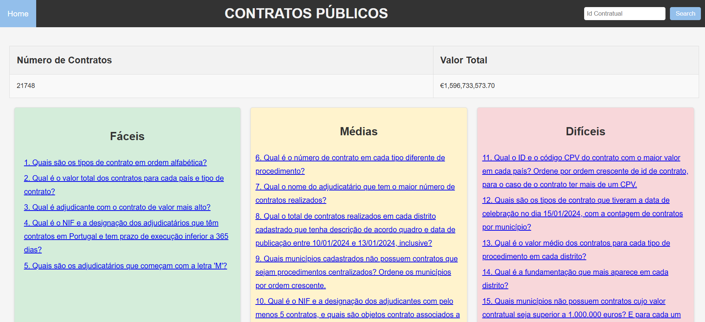
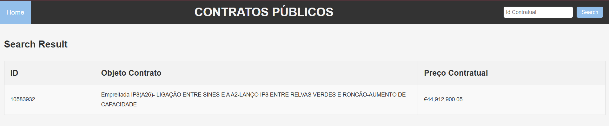
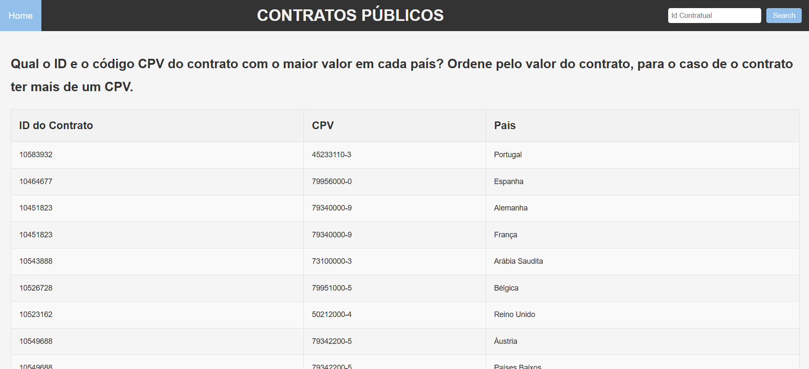

# Contratos Públicos
Base de Dados de Contratos Públicos
Este projeto foi desenvolvido como parte da disciplina Base de Dados do curso de Ciência de Computadores e de Inteligência Artificial e Ciência de Dados da Faculdade de Ciências da Universidade do Porto. O objetivo foi modelar, povoar e interagir com uma base de dados de contratos públicos, seguindo boas práticas de modelagem e normalização.



## Objetivo
O projeto pretende constituir uma oportunidade de experimentação das matérias expostas na unidade curricular, em particular a especificação de um modelo UML e respetiva tradução para um modelo relacional e a criação, o povoamento e a interrogação de BD utilizando a linguagem SQL.

## Tecnologias Utilizadas
- SQLite: Banco de dados utilizado.
- SQLite3: Biblioteca para interação com o SQLite.
- OpenPyxl: Para povoamento automatizado dos dados.
- Flask: Framework para criação da interface web.

## Funcionalidades
### Modelagem de Dados:
- Diagramas UML
- Modelo relacional

Seguindo os padrões da 3ª Forma Normal (3FN).

### Povoamento Automatizado:
- Dados gerados e inseridos automaticamente usando Python e a biblioteca OpenPyxl.

### Consultas SQL:
- 15 queries organizadas em 3 níveis de dificuldade.
Interface Web:

### Interface:
- Pesquisa de contratos públicos por ID.

- Visualização das queries.



## Estrutura do Projeto 
```
/pasta-do-projeto
├── /dataset
│   ├── ContratosPublicos2024.txt     # Informações sobre o dataset
│   └── ContratosPublicos2024.xlsx    # Dataset utilizado     
├── /interface      
│   ├── app.py                        # Aplicação Flask
│   ├── db.py                         # Conexão com a base de dados
│   └── server.py                     # Servidor do projeto
├── /modelagem
│   ├── uml.png                       # Diagrama UML do sistema
│   └── modelo-relacional.png         # Modelo relacional
├── /povoamento
│   ├── schema.sql                    # Script para criar as tabelas
│   └── seed.py                       # Script para popular o banco de dados
├── /queries                          # Codigo das queries utilizadas na interface
│   ├── q1.sql 
|   |   ...   
│   └── q15.sql
|── README.md                         # Este arquivo
└── Relatorio.docx                    # Relatório do projeto
```

## Como Executar
### Pré-requisitos
- Python 3.10 ou superior
- SQLite instalado

### Passo a Passo
1. Clone o Repositório:
    ```
    git clone https://github.com/bzabot-CS/databases.git
    cd databases
    ```

2.  Instale as Bibliotecas Necessárias:
    ```
    pip install openpyxl flask  
    ```

3. Criação e Povoamento do Banco de Dados:
    - Criar a base de dados: 
    ```
    python povoamento/schema.py
    ```
    - Popular a base de dados:
    ```
    python povoamento/seed.py
    ```

3. Inicie a Interface Web:
    ```
    python interface/server.py
    ```
A aplicação estará disponível no navegador através do endereço http://127.0.0.1:9000

## Participantes do Projeto - Grupo G2A
- [Bruno Souza Zabot](https://github.com/bzabot) (up202302069)
- [Guilherme Ferreira Klippel](https://github.com/Klippell) (up202300276)
- [Isabela Britto Cartaxo](https://github.com/belacartaxo) (up202300339)
